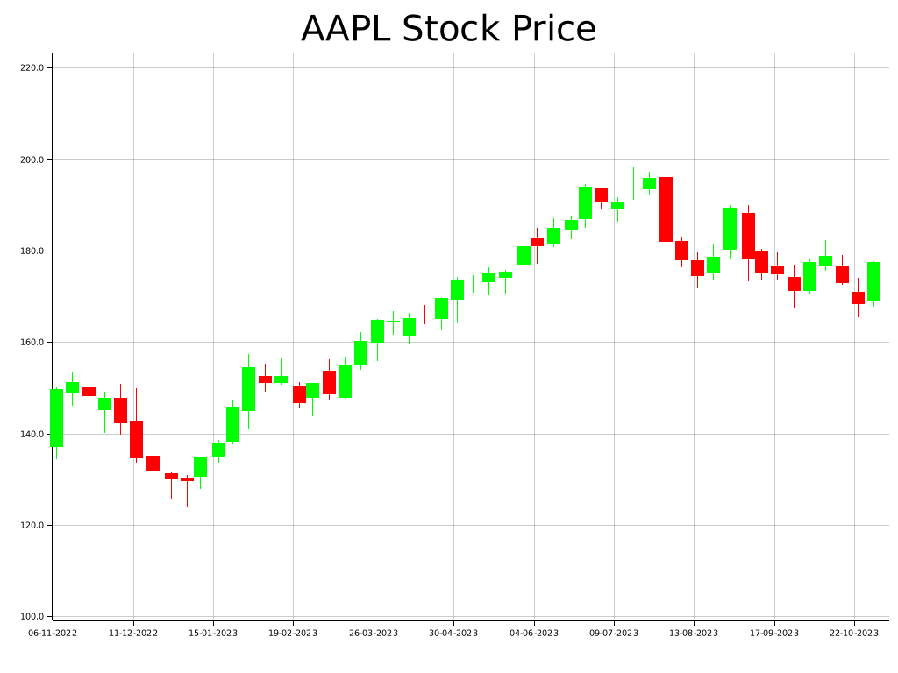
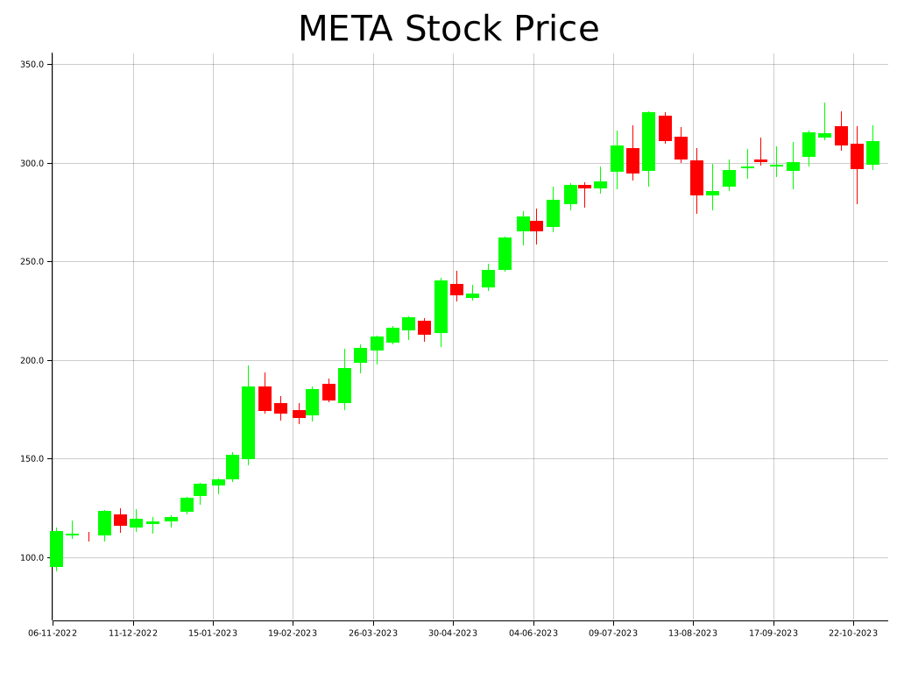
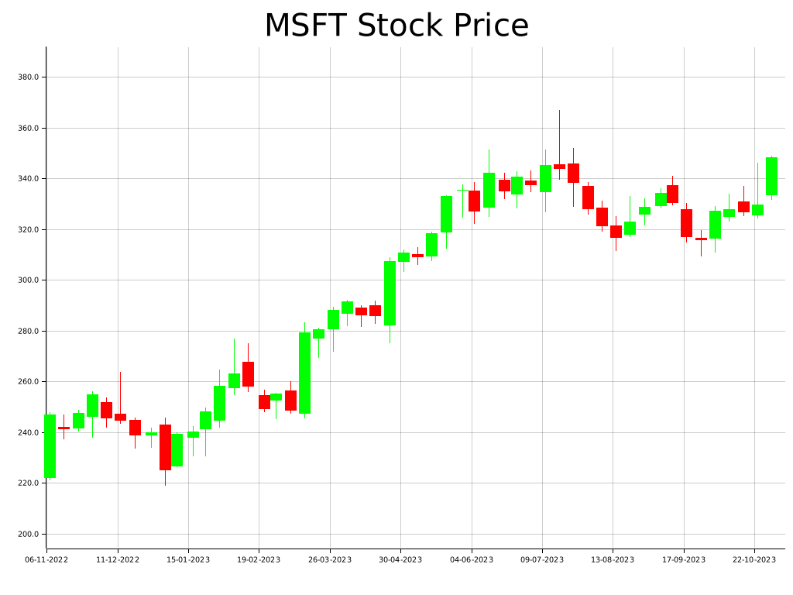
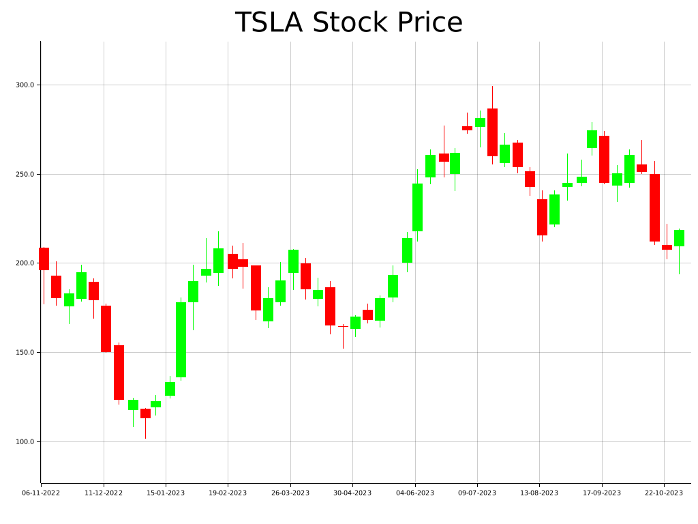

# Stock CLI

A Rust-based CLI application that will fetch prices of a given company's symbol from 1 year ago to the current date, then visualize it as a candle stick chart. Finally, the chart will be exported as a png file.

The default symbol will be AAPL and the default time frame is every week.

## Dependencies

1. Reqwest
2. Tokio
3. Plotter
4. Finhub API

## Gallery

1. AAPL

2. META

3. MSFT

4. TSLA

